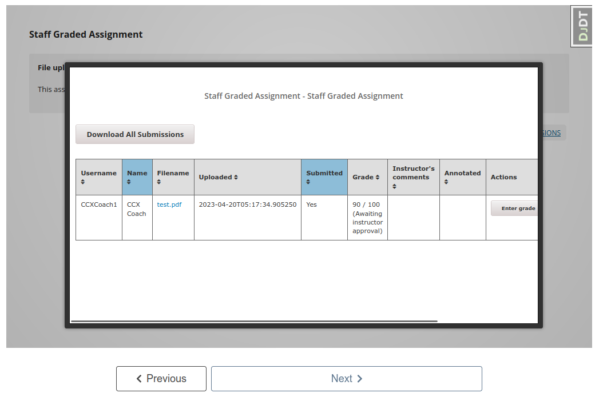
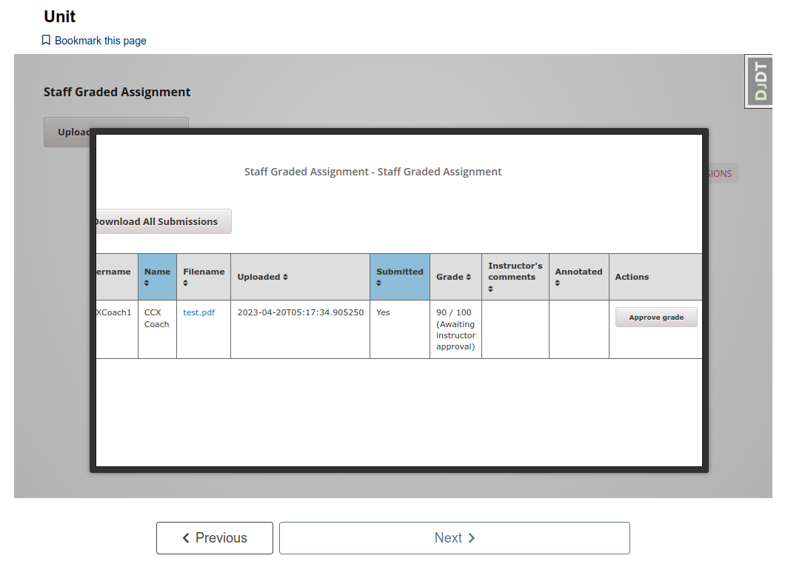
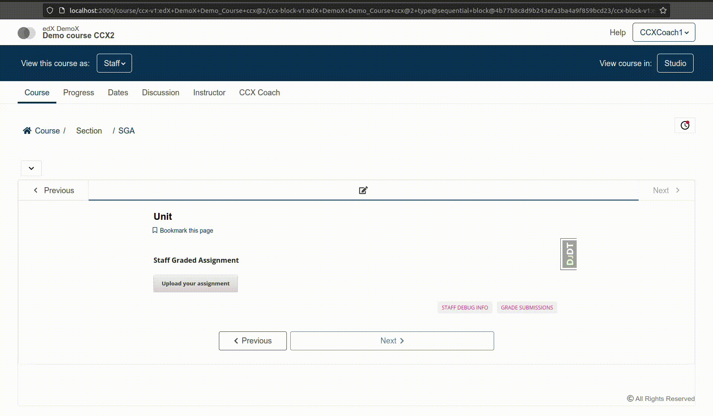

# Custom features for SGA.

## Grading for CCX coaches.

### Context

Out-of-the-box, SGA only allows the main-course admin users (instructors in the course access role model) to grade assignments.

This image shows the SGA view where course admins users can grade student submissions. As shown, the CCX coach cannot grade student submissions:

This image shows the same SGA view, but with an admin role, indicating that only admin users of the course can grade student submissions:

### Feature

This feature allows CCX coaches (ccx_coach in the course access role model) and CCX admin users (instructor in the course access role model) to grade assignments in their CCX courses.

